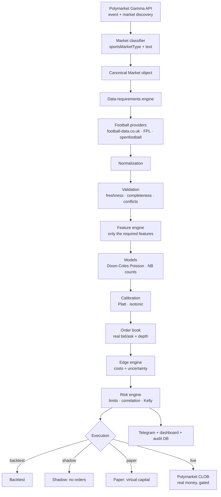

# Football Market AI Trader

An open-source research engine that **discovers the football markets which actually exist on
Polymarket**, models their true probability from football data, compares that against the price you
can really execute at, applies hard risk limits, and only then decides **BUY / SELL / NO TRADE**.

It runs in four modes — **backtest, shadow, paper and live** — with **live trading disabled by
default**. It ships with no credentials, no keys and no developer funds: every user brings their own
account, their own data keys and their own risk appetite.

> **This is not financial advice and there is no profit guarantee.** Prediction markets can and do
> lose money. Read [SECURITY.md](SECURITY.md) and [docs/SECURITY.md](docs/SECURITY.md) before you
> consider live mode.

---

## The design principle

The single rule the whole codebase obeys:

```
POLYMARKET MARKET
  -> WHAT IS ACTUALLY TRADEABLE?
  -> WHAT DATA IS REQUIRED?
  -> CAN WE GET THAT DATA RELIABLY?
  -> WHAT IS THE MODEL PROBABILITY?
  -> IS IT CALIBRATED?
  -> WHAT IS THE REAL EXECUTABLE MARKET PRICE?
  -> WHAT IS THE REALISTIC EDGE AFTER COSTS/UNCERTAINTY?
  -> IS THE RISK ACCEPTABLE?
  -> BUY / SELL / NO TRADE
```

**This logic is never reversed.** The bot does not predict football and then hunt for a market to
fit the prediction onto. It starts from the market that exists, asks what data that market needs,
and refuses (`INSUFFICIENT_DATA` / `UNSUPPORTED` / `NO TRADE`) when the data is missing, stale or
unsourceable. **Missing data is never imputed, averaged or guessed.**

## Architecture



See [docs/ARCHITECTURE.md](docs/ARCHITECTURE.md) for the module map and the edge-decomposition
table.

## Features

| Area | What it does |
|---|---|
| **Discovery** | Pages the real Gamma API, resolves the soccer tag dynamically, pulls every live football market. Never hardcodes market ids. |
| **Classification** | Maps Polymarket's own `sportsMarketType` metadata to a market family, with a discounted text fallback. Contradictions become `UNKNOWN` -> no trade. |
| **Data requirements** | `MARKET TYPE -> REQUIRED DATA -> FEATURES -> MODEL`, configurable in `configs/requirements.json` without touching Python. |
| **Providers** | Pluggable adapters. football-data.co.uk (results, shots, corners, cards, closing odds), official FPL API (xG/90, availability, minutes), openfootball (fixtures). Every one fails closed. |
| **Validation** | Freshness, completeness, impossible values, cross-provider identity conflicts, stale lineups, stale prices. |
| **Models** | Dixon-Coles style bivariate Poisson for match result / totals / team totals / BTTS; Poisson and negative-binomial count models for corners and player props. No LLM is ever the numerical model. |
| **Calibration** | Platt scaling and isotonic regression fitted on out-of-sample walk-forward predictions; Brier score, log loss, reliability curves, ECE. |
| **Edge** | Raw edge minus spread share, slippage, fees, model/data/execution uncertainty. Prints the full decomposition. |
| **Risk** | Fractional Kelly **hard-capped** by max trade size, daily exposure, daily loss, open-position count and **correlation-bucketed** exposure. Circuit breaker / kill switch. |
| **Execution** | Price recheck before every order, duplicate-order protection, idempotent client order ids, depth and slippage preview. Financial orders are never blind-retried. |
| **Modes** | Backtest · Shadow (no orders) · Paper (virtual capital, real book) · Live (all gates). |
| **Observability** | Every decision is written to SQLite with its signal id, feature snapshot, model/prompt versions and full edge trace. Structured logs with mandatory secret redaction. |
| **Dashboard** | 15-tab Streamlit UI: overview, markets, signals, positions, orders, performance, backtest, risk, data, AI, Telegram, wallet, logs, settings. Read-only by design. |

## Quick start

```bash
# 1. clone
git clone https://github.com/<YOUR_GITHUB_USERNAME>/football-market-ai-trader.git
cd football-market-ai-trader

# 2. virtual environment
python -m venv .venv
source .venv/bin/activate          # Windows: .venv\Scripts\activate

# 3. dependencies
pip install -r requirements.txt

# 4. create your .env from the template (add YOUR OWN credentials; never commit it)
python -m app.cli init

# 5. system check - proves providers, database, risk config and secret hygiene
python -m app.cli check

# 6. what football markets exist on Polymarket RIGHT NOW?
python -m app.cli markets

# 7. model them and print signals (places nothing)
python -m app.cli signals --limit 25
```

### Then, in this order

```bash
# historical walk-forward test of the model and the strategy
python -m app.cli backtest --market-type MATCH_RESULT --league E0

# fit the probability calibrator on out-of-sample backtest output
python -m app.cli calibrate --market-type MATCH_RESULT --league E0

# shadow: real data, real decisions, ZERO orders
python -m app.cli shadow --limit 25

# paper: live data, virtual capital, simulated fills, real risk limits
python -m app.cli paper --limit 25 --iterations 4 --poll 120

# dashboard (read-only)
streamlit run app/dashboard/streamlit_app.py
```

### Live trading — real money

Live is off by default and needs **all** of the following:

```bash
# 1. in .env
POLYMARKET_ALLOW_LIVE_TRADING=true

# 2. a DEDICATED trading wallet key (never your main wallet, never a seed phrase)
POLYMARKET_PRIVATE_KEY=0x...        # from https://reveal.polymarket.com

# 3. the explicit confirmation phrase, exactly
python -m app.cli live --limit 5 --confirm "I UNDERSTAND THE RISK" --i-understand-risk
```

If any pre-flight check fails, **no order is placed**. Read
[docs/USER_GUIDE.md](docs/USER_GUIDE.md) first.

## Supported market families

Derived from Polymarket's live `sportsMarketType` taxonomy, **not hardcoded**:

| Family | Status | Data source |
|---|---|---|
| Match result (moneyline) | ✅ tradeable | football-data.co.uk |
| Total goals (O/U) | ✅ tradeable | football-data.co.uk |
| Both teams to score | ✅ tradeable | football-data.co.uk |
| Team totals | ✅ tradeable | football-data.co.uk |
| Total / team corners | ✅ tradeable | football-data.co.uk |
| Player goals | ✅ tradeable | FPL (xG/90, availability) + minutes model |
| Player assists | ✅ tradeable | FPL |
| Player goals + assists | ✅ tradeable | FPL |
| Player shots | ⚠️ needs a shots feed | FPL does **not** publish per-player shots -> refuses by default |
| Cards / corners-odd-even / exact score / half-time / first-to-score / to-advance / penalty shootout | ⛔ not tradeable in v1.0 | no reliable data path -> `UNSUPPORTED` |

Adding a family is a documented four-part change: see [CONTRIBUTING.md](CONTRIBUTING.md).

## Configuration

Everything user-tunable lives in `configs/config.yaml` and `.env` — **you never edit Python to
configure the bot**. `.env.example` carries placeholders only; the real `.env` is gitignored.

Every variable is documented in [docs/CONFIGURATION.md](docs/CONFIGURATION.md).

## Documentation

| Document | Contents |
|---|---|
| [docs/USER_GUIDE.md](docs/USER_GUIDE.md) | Step-by-step setup for a non-programmer: Python, Git, clone, `.env`, Polymarket account, data keys, and the backtest -> shadow -> paper -> live ladder. |
| [docs/CONFIGURATION.md](docs/CONFIGURATION.md) | Every environment variable and YAML key, with purpose and examples. |
| [docs/ARCHITECTURE.md](docs/ARCHITECTURE.md) | Module map, data flow, the edge-decomposition table, model maths, and **data limitations**. |
| [docs/SECURITY.md](docs/SECURITY.md) | Wallet setup, key handling, threat model, how to revoke. |
| [docs/TROUBLESHOOTING.md](docs/TROUBLESHOOTING.md) | Auth failures, allowance problems, stale data, order rejections, provider outages. |
| [docs/DEVELOPMENT_STATUS.md](docs/DEVELOPMENT_STATUS.md) | Phase-by-phase status, what is verified, what is simulated, known limitations. |
| [CHANGELOG.md](CHANGELOG.md) | Release history. |
| [SECURITY.md](SECURITY.md) | Vulnerability disclosure policy. |

## Testing

```bash
pytest -q                      # 420 unit + integration tests, no network, no credentials
pytest -q -m network           # opt-in tests that hit the live public APIs
ruff check .                   # lint
python scripts/scan_secrets.py # repository secret scan (also runs in CI)
```

CI (`.github/workflows/tests.yml`) runs ruff, configuration validation, the full test suite and the
secret scan on Python 3.10/3.11/3.12, plus bandit and pip-audit.

## Security

* **A seed phrase is never accepted.** `src/wallet/keystore.py` refuses anything mnemonic-shaped,
  loudly. Only a **dedicated trading wallet** private key, from your local `.env` or the OS keyring.
* Nothing sensitive ever reaches a log: every record passes a redaction filter for 64-hex keys,
  mnemonics, Telegram tokens, JWTs and `api_key=`-style pairs.
* Live mode is triple-gated: env flag + confirmation phrase + passing pre-flight.
* `.gitignore` excludes `.env`, databases, logs, `secrets/`, `credentials/`, `private_keys/`; CI
  fails the build if a credential-shaped string is ever committed.
* Use a dedicated wallet funded with only what you can afford to lose. See
  [docs/SECURITY.md](docs/SECURITY.md).

## Docker

```bash
docker compose up --build          # runs `check` by default; live stays disabled
```

The image bakes in no secrets, runs as an unprivileged user, and mounts `data/`, `logs/` and
`configs/` (read-only) from the host.

## Contributing

See [CONTRIBUTING.md](CONTRIBUTING.md). The bar is deliberately high for anything touching live
gating, risk limits or the LLM boundary. Two invariants no pull request may break:

1. **Fail closed** — missing/stale/unsupported data means `NO TRADE`, never an imputed value.
2. **The LLM never decides** — it extracts facts; it cannot set `decision`, `side`, `size` or `price`.

## License

MIT — see [LICENSE](LICENSE).

## Disclaimer

This project is software for **research and automation purposes**. It does **not** guarantee
profits, positive returns, or any particular outcome, and nothing it produces is financial advice.

Trading prediction markets involves substantial risk of loss, and you may lose your entire deposit.
You are solely responsible for your own funds, credentials, wallets and regulatory compliance. The
authors and contributors have no access to and no control over any user's funds, accounts or keys.

Live trading is disabled by default. Start in backtest, shadow and paper modes. Never trade more
than you can afford to lose.
